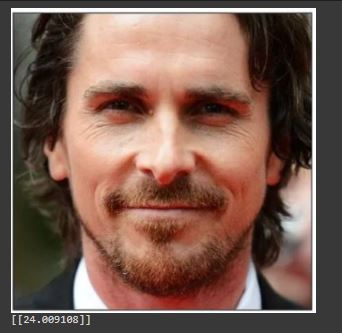
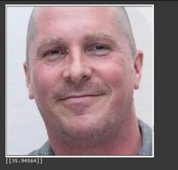

# BMI Predictor using Facial Images

This project aims to build a BMI (Body Mass Index) predictor using facial images of individuals. The dataset used is the "iDoc Mugshots" dataset. We are interested in the "front" folder, which contains frontal mugshot images of individuals.

## Dataset


**BMI Prediction from Frontal Mugshot Images**

This project focuses on predicting BMI (Body Mass Index) based on frontal mugshot images. The dataset consists of 70,000 images, and we aim to build a deep-learning model that can predict BMI values using the images.

The dataset used in this project is available at the following Google Drive link:

[Download Dataset](https://drive.google.com/file/d/1f33oxkmRjDXaWAmeQAvkS7iXo1Yv12dB/view?usp=sharing)

The dataset is provided in a zip file that contains two main components:
1. `front` folder inside `front` folder: The front folder contains the subfolder front for the images. The images are named using unique identifiers like `M47396` etc.
2. `label.csv`: This CSV file contains the BMI values corresponding to each individual image in the dataset.
3. Unzip this file in `/bmi` folder. Check the project Structure below


## Project Structure

```
project_root/
│   README.md
│   bmi_predictor.ipynb
└───bmi/
│   └───front/
│   │   └───front/
│   │   │   │   M47396
│   │   │   │   ...
│   label.csv
│   model.tflite
└───output/
│   │   Obese.JPG
│   │   obese.jpeg

```
## Instructions
1. Download the dataset
2. unzip the dataset in `/bmi`
3. Ensure that you have the required Python packages installed. You can install them using `pip`, You can add ! to access the terminal inside Jupyter Notebook:
```
!pip install numpy pandas tensorflow opencv-python
```
4. Run the `bmi_predictor.ipynb` script to train the BMI predictor model and generate the TFLite model file.
5. Once the training is complete, you can use the generated `model.tflite` file to make predictions on new facial images.
That's it! You have now successfully trained a BMI predictor model using facial images and can use it to predict BMI values based on new facial images.
### Output

After training the deep learning model on the dataset, we can use it to predict BMI values for new frontal mugshot images. Below are two sample output images, one with a normal BMI and the other with an overweight BMI:

Christian Bale with normal weight shows a BMI that falls under the normal range of 18.5 > BMI < 25
 

Christian Bale with obesity shows the correct value of BMI, which is BMI > 30 is in the obesity range


